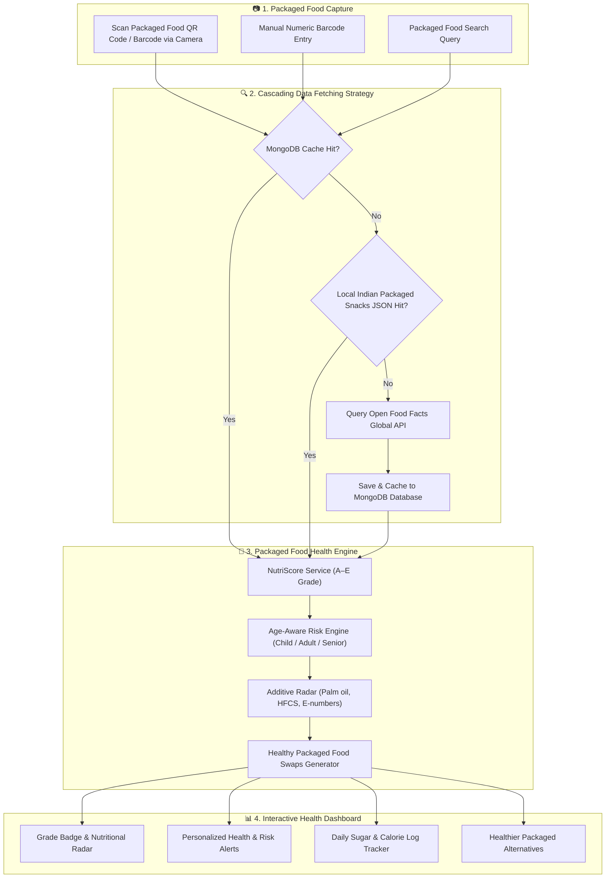

# 📦 🥗 NutriScan: Packaged Food QR & Barcode Nutrition Scanner


[](https://reactjs.org/)
[](https://vitejs.dev/)
[](https://nodejs.org/)
[](https://expressjs.js.org/)
[](https://www.mongodb.com/)
[](https://tailwindcss.com/)
[](LICENSE)
[](CONTRIBUTING.md)

**NutriScan** is an AI-powered smart nutrition scanner built to instantly analyze **packaged food items** (such as packaged snacks, cereals, canned foods, beverages, chocolates, and packaged grocery items) by scanning their **QR codes** or **1D/2D barcodes**.

With a single camera scan of any packaged food item, NutriScan instantly decodes complex nutrition labels, calculates official NutriScore grades (A to E), flags hidden toxic additives (palm oil, HFCS, sodium), evaluates personalized age-aware health risks, and recommends healthier packaged food swaps.

---

## 🚀 Quick Links & Live Deployments

| Resource | URL | Description |
| :--- | :--- | :--- |
| **🌐 Web Application** | [nutriscan-food.vercel.app](https://nutriscan-food.vercel.app/) | Production Frontend hosted on Vercel |
| **⚙️ Backend API** | [nutriscan-6okf.onrender.com](https://nutriscan-6okf.onrender.com/) | Live Express.js REST API on Render |
| **📄 Postman API Docs** | [Postman Collection](https://documenter.getpostman.com/view/50839854/2sBXqKofJw) | Complete API Endpoint Documentation |
| **🎨 Figma UI Prototype** | [View Design](https://www.figma.com/design/wFYOlNMilBqg11MpBWax2m/first?node-id=6-12&t=jEuMUfFKnn8rHxBG-1) | Interactive UI/UX Design System |
| **📺 Demo Video** | [Watch Video](https://www.youtube.com/watch?v=2H2T3d6530kqw) | App Walkthrough & Features Demo |

---

## 📱 App Interface Preview


*Clean, modern, and accessible packaged food health analytics dashboard.*

---

## 💡 How Packaged Food QR Scanning Works: Complete Flow

NutriScan captures QR codes & 1D/2D barcodes on packaged food items and passes them through a cascading multi-tier database strategy.



### Data Pipeline & Cascading Fallback Mechanics

```mermaid
sequenceDiagram
    autonumber
    actor User
    participant Frontend as React Frontend (Vite)
    participant Backend as Express REST API
    participant Mongo as MongoDB Cache
    participant LocalData as indianSnacks.json
    participant OFF as Open Food Facts API

    User->>Frontend: Scan Packaged Food QR / Barcode
    Frontend->>Backend: GET /api/scan/barcode?barcode=PACKAGED_CODE
    
    Backend->>Mongo: 1. Check MongoDB Cache for Packaged Product
    alt Cache HIT
        Mongo-->>Backend: Return Cached Product Document
    else Cache MISS
        Backend->>LocalData: 2. Check Local Packaged Snacks Database
        alt Local HIT
            LocalData-->>Backend: Return Local Packaged Snack Object
        else Local MISS
            Backend->>OFF: 3. Query Open Food Facts Global Database
            OFF-->>Backend: Return Raw Packaged Food Nutrients
            Backend->>Mongo: 4. Upsert & Cache Product Document
        end
    end

    Backend->>Backend: 5. Calculate NutriScore (A–E)
    Backend->>Backend: 6. Calculate Age-Aware Risk (Child/Adult/Senior)
    Backend->>Backend: 7. Scan Ingredients for Toxic Additives & Preservatives
    Backend->>Backend: 8. Compute Healthier Packaged Food Alternatives

    Backend-->>Frontend: Return Analyzed Packaged Product Payload
    Frontend->>User: Render Dashboard, Warnings, Charts & Swaps
```

---

## 🔥 Key Features & Technical Capabilities

### 📷 1. Instant Packaged Food QR Code & Barcode Scanner
- Built with **`@zxing/library` (`BrowserMultiFormatReader`)**.
- Uses HTML5 video stream to decode standard 1D barcodes (EAN-13, EAN-8, UPC) and 2D QR codes on packaged food boxes, bags, cans, and bottles in real-time.
- Features a camera overlay with animated scanning lines and manual numeric entry fallback.

### 🏆 2. French NutriScore A–E Rating for Packaged Foods
- Implements an automated NutriScore calculator based on European dietary standards for packaged food evaluation.
- Evaluates negative points (Energy in kJ, Sugars, Saturated Fats, Sodium per 100g) against positive points (Dietary Fiber, Proteins).
- Outputs clear letter grades (**A, B, C, D, E**) with color-coded visual indicators.

### 🎯 3. Age-Aware Personalized Health Risk Engine
- Dynamically adjusts nutrient danger thresholds based on user age bracket:
  - **Child**: Stricter sugar (<5g–10g) and fat limits.
  - **Adult**: Standard daily intake limits.
  - **Senior**: Stricter sodium (<400mg) and saturated fat constraints.
- Generates actionable warnings such as *"High diabetes + obesity risk"* or *"Heart & kidney risk"*.

### ⚠️ 4. Packaged Food Additive & Preservative Radar
- Scans packaged food ingredient lists for artificial preservatives, trans fats, high-fructose corn syrup (HFCS), palm oil, and harmful E-number food additives.

### 🔄 5. Healthier Packaged Swaps & Alternatives Engine
- Automatically searches for higher-rated food alternatives within the same packaged food category, providing healthier choices when grocery shopping.

### 📊 6. Daily Packaged Intake Tracker
- Logs scanned packaged products to session history.
- Calculates total sugar, sodium, fat, and calories consumed against WHO/AHA daily recommended limits (e.g., 25g max daily sugar).
- Renders 7-day trend charts powered by **Chart.js**.

---

## 🛠️ Tech Stack & Dependencies

### Frontend (`/frontend`)
- **Framework:** React 19, Vite
- **Styling & UI:** Tailwind CSS, Lucide React icons
- **Barcode Scanning:** `@zxing/library`
- **Data Visualization:** `chart.js`, `react-chartjs-2`

### Backend (`/backend`)
- **Runtime:** Node.js, Express.js REST API
- **Database & ORM:** MongoDB, Mongoose
- **Fuzzy Search:** `Fuse.js` (for fast local food search with typo tolerance)
- **External Integration:** Open Food Facts REST API

---

## 📂 Project Directory Structure

```text
nutriscan/
├── frontend/                     # React + Vite Frontend Application
│   ├── public/                   # Static assets & health banner
│   │   ├── health-banner.jpg
│   │   └── image.png
│   ├── src/
│   │   ├── components/           # Modular UI Components
│   │   │   ├── Scanner.jsx       # Camera Barcode Scanner component (@zxing/library)
│   │   │   ├── NutritionCard.jsx # Nutrient radar & metric breakdown
│   │   │   ├── NutriScoreBadge.jsx # Grade A–E badge indicator
│   │   │   ├── RiskBadge.jsx     # Health risk warning card
│   │   │   ├── Alternatives.jsx  # Healthier swap recommendations
│   │   │   ├── DailySugarTracker.jsx # Daily consumption tracker
│   │   │   ├── WeeklySugarChart.jsx  # Chart.js weekly sugar graph
│   │   │   ├── ManualEntry.jsx   # Manual barcode & search entry
│   │   │   ├── HistoryView.jsx   # Past scan history list
│   │   │   └── ProfilePage.jsx   # User profile & age group settings
│   │   ├── App.jsx               # Primary application layout & router
│   │   └── main.jsx              # React application entry point
│   └── package.json
│
├── backend/                      # Node.js + Express.js REST Backend
│   ├── src/
│   │   ├── config/               # Database connection (MongoDB)
│   │   ├── controllers/          # Route Request Controllers
│   │   │   ├── scan.controller.js # Barcode scan & search logic
│   │   │   ├── analyse.controller.js # Manual product evaluation
│   │   │   ├── alternatives.controller.js # Healthy swap finder
│   │   │   └── history.controller.js # User scan logs & summaries
│   │   ├── services/             # Core Analytical Engines
│   │   │   ├── nutriScore.service.js # Official NutriScore A–E algorithm
│   │   │   ├── risk.service.js   # Age-aware health risk evaluation
│   │   │   ├── ingredient.service.js # Additive & warning scanner
│   │   │   ├── alternatives.service.js # Healthier substitute matching
│   │   │   └── scan.service.js   # DB scan persistence & summaries
│   │   ├── models/               # Mongoose Schemas (Product, Scan, User)
│   │   ├── data/                 # Local Indian snacks fallback database
│   │   │   └── indianSnacks.json
│   │   ├── routes/               # Express API Route definitions
│   │   └── app.js                # Express app setup & middleware
│   ├── index.js                  # Backend server entry point
│   └── package.json
│
└── README.md                     # Project documentation
```

---

## ⚡ API Endpoint Reference

| Method | Endpoint | Description |
| :--- | :--- | :--- |
| `GET` | `/api/scan/barcode?barcode={code}` | Fetch product by barcode (MongoDB -> Local -> OpenFoodFacts) |
| `GET` | `/api/scan/search?q={query}` | Search products by name using OpenFoodFacts + Fuse.js |
| `POST` | `/api/scan/analyse` | Analyze manually entered nutritional values |
| `GET` | `/api/scan/alternatives?category={cat}` | Get healthier product alternatives |
| `GET` | `/api/scan/history?sessionId={id}` | Retrieve recent scan history for user session |
| `GET` | `/api/scan/summary/daily?sessionId={id}` | Get daily accumulated nutrient consumption summary |
| `GET` | `/api/scan/summary/weekly?sessionId={id}` | Get 7-day sugar intake history for charting |

---

## 🚀 Setup & Installation Guide

### Prerequisites
- Node.js (v18+)
- npm or yarn
- MongoDB Atlas database URI or local MongoDB instance

### 1. Environment Configuration
Create a `.env` file inside the `backend/` directory:

```env
PORT=3001
MONGO_URI=mongodb+srv://<username>:<password>@cluster.mongodb.net/nutriscan?retryWrites=true&w=majority
JWT_SECRET=your_super_secret_jwt_key
OPEN_FOOD_FACTS_API=https://world.openfoodfacts.org/api/v0
```

### 2. Start the Backend API Server
```bash
cd backend
npm install
npm run dev # Starts server on http://localhost:3001
```

### 3. Start the Frontend Development Server
```bash
cd frontend
npm install
npm run dev # Starts Vite server on http://localhost:5173
```

---

## 📜 Repository Documentation & Governance

To maintain open-source transparency, security, and community governance, NutriScan includes all standard GitHub repository documentation:

| Document | Description | Link |
| :--- | :--- | :--- |
| **📜 License** | MIT Open Source License | [LICENSE](LICENSE) |
| **🤝 Contributing Guidelines** | How to contribute, commit conventions & PR workflow | [CONTRIBUTING.md](CONTRIBUTING.md) |
| **📜 Code of Conduct** | Community pledge and standards (Contributor Covenant v2.1) | [CODE_OF_CONDUCT.md](CODE_OF_CONDUCT.md) |
| **🛡️ Security Policy** | Vulnerability reporting procedure & security practices | [SECURITY.md](SECURITY.md) |

---

## 🤝 Contributing

We welcome contributions of all sizes! Whether you are fixing bugs, improving documentation, adding new food database adapters, or enhancing UI design, please refer to our [Contributing Guidelines](CONTRIBUTING.md) before submitting a Pull Request.

1. Fork the Project repository.
2. Create your Feature Branch (`git checkout -b feature/AmazingFeature`).
3. Commit your Changes (`git commit -m 'feat: add AmazingFeature'`).
4. Push to the Branch (`git push origin feature/AmazingFeature`).
5. Open a Pull Request.

---

## 🛡️ Security & Privacy

We treat security and user privacy as top priorities. If you discover a vulnerability or security issue, please review our [Security Policy](SECURITY.md) to report it responsibly.

---

## ✨ Contributors

Thanks to all the amazing people who have contributed to building NutriScan!

<a href="https://github.com/harshit-kumar-dev/nutriscan/graphs/contributors">
  
</a>

---

## 📜 License

Distributed under the **MIT License**. See [`LICENSE`](LICENSE) for more information.

---

Developed with ❤️ for a healthier lifestyle by Harshit Kumar.

